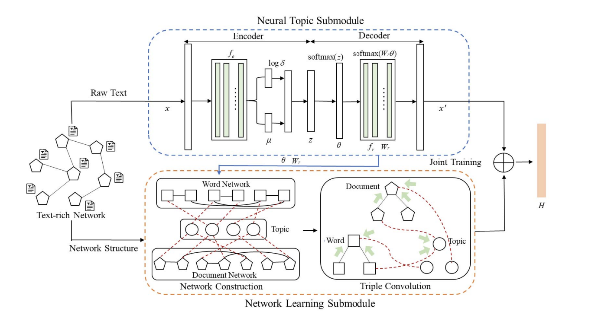
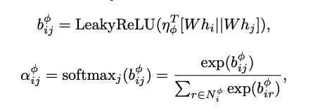

# AS-GCN: Adoptive Semantic Architecture of Graph Convolutional Networks for Text-Rich Networks  

최근에 그래프 신경망(이후엔 GNN으로 표기)을 활용한 추천시스템에 대한 연구를 계속해오고 있었습니다. 특히, 사용자의 제품에 대한 리뷰와 같은 텍스트 데이터를 효과적으로 활용하는 부분에 대해 연구를 진행했습니다. 이번에 리뷰할 논문은 ICDM 에서 2021년에 발표된 논문으로, GNN을 활용하여 문서노드의 유형을 분류할때 보다 효과적으로 텍스트 데이터를 활용한 방법을 소개하고 있습니다.  

논문링크
[https://ieeexplore.ieee.org/document/9679149](https://ieeexplore.ieee.org/document/9679149) 

## **1. Problem Definition**  

논문에서는 document간의 citation 정보와 document raw-text를 기반으로 document 의 유형을 분류하는 문제를 GNN기반으로 접근하고 있습니다. 흥미로운점은 document node 로만 구성된 homogenuous graph 가 아닌 word, topic, document 3가지 노드타입으로 구성된 tri-typed graph를 구성하여 학습한다는 점입니다. 라벨 데이터는 주어졌으나, 사실상 clustering task로도 볼 수 있기 때문에 semi-supervised 로 설명하고 있습니다.

## **2. Motivation**  

기존에 소개된 대부분의 GNN기반 모델들은 그래프 구조정보를 바탕으로 학습을 하는 경우가 많습니다.
추천시스템에서 많이 사용되는 GCN 기반의 모델들의 경우, node feature와 그래프 구조 정보에 의존하는 연구가 대부분입니다. 이러한 경우, 사용자 혹은 아이템의 메타데이터를 활용하여 node feature를 생성하게 됩니다.  

이 논문에서는 그래프 구조 정보와 함께, 단어-토픽 연결 구조를 추가적으로 학습에 활용하여 텍스트 상의 의미정보를 반영하려 시도하였습니다. Document로 이루어진 데이터셋을 그래프 구조로 재 해석하고 해당 그래프에 GNN을 적용하여 노드 유형을 분류하고자 하였습니다. 공개 데이터셋 이외에 실제 e-commerce 에 해당 모델을 적용하여 실험을 진행하였습니다.

본 논문의 핵심 컨티리뷰선은 아래와 같이 정리될 수 있습니다. 
- GNN message-passing 만으로는 텍스트의 의미적 구조를 완전히 활용하지 못함을 밝혀냄
- text-rich network representation 을 추출할 수 있고, 단어의 의미를 활용하는 ene-to-end GCN 구조를 제안
- 4가지 text-rich network 데이터셋과 e-commerce 을 통한 실험 검증을 진행

## **3. Method**  

AS-GCN 은 두가지 부분으로 구성됩니다. 텍스트 정보를 분석하여 topic distribution을 학습하는 Neural Topic Module 과, 그래프 구조정보를 학습하는 Network Learning Module 입니다. 

## Neural Topic Module(NTM) 
Neural Topic Module은 VAE 기반의 모듈로 encoding-decoding 과정을 통해 잠재 토픽을 학습합니다.
VAE와 같이 encoder를 통해 평균과 분산을 얻고 잠재 토픽 벡터 z를 얻게 됩니다.
z에 softmax를 취하면 토픽 분포인 θ를 얻고 이를 통해 단어별 확률 값을 계산합니다.
여기서 얻은 단어별 확률값은 다음 네트워크 모듈에서 그래프를 형성할때 사용됩니다.
이를 수식으로 표현하면 아래와 같습니다.

 
    

Encoder를 통해 평균과 분산을 구하는 과정 

토픽 분포를 생성

맵핑 함수를 통해 단어별 확률 값을 얻음

Topic representation 을 계산

 

## Network Learning Module 
네트워크 학습 모듈에서는 그래프 구조 정보를 학습하게 됩니다.
주어진 문서 네트워크를 tri-typed 네트워크로 변환하고 이를 합성곱을 통해 연산하게 됩니다. 이 과정은 다른 GCN과 동일한 방식으로 이루어집니다. 다만, 차이점이 있다면 3가지 노드의 타입, 4가지 엣지의 타입이 있고, 전파 단계에 따라 레이어가 분리된다는 것입니다.

### 네트워크 구성

NTM 에서 얻은 분포를 바탕으로 추출한 단어를 기반으로 그래프를 생성합니다. 
그래프는 문서, 토픽, 엔티티(단어) 의 3가지 노드로 구성됩니다. 
이 노드들은 총 4가지의 엣지로 연결되는데 다음과 같습니다.
- 문서간의 citation 엣지  $E_D$
- 문서와 토픽간의 엣지  $E_{DT}$
- 토픽과 엔티티간의 엣지  $E_{TM}$
- 엔티티 노드간의 연결 정보 $E_M$

엔티티 노드간의 엣지는 단어 간의 엣지로 볼 수 있는데 저자는 ‘local word sequence semantics’라고 표현 하고 있습니다. sliding window를 활용하여 단어의 시퀀스를 추출하고 PMI를 적용하여 단어들간의 관계정도를 수치로 변환합니다. PMI에 대한 자세한 설명은 아래 링크를 확인하시길 바랍니다.
[https://en.wikipedia.org/wiki/Pointwise_mutual_information](https://en.wikipedia.org/wiki/Pointwise_mutual_information)

global topic 구조정보는 $E_{TD}, E_{TM}$ 엣지를 통해 표현됩니다. 이 엣지들은 NTM으로부터 얻은 토픽 분포를 기반으로 생성됩니다. 

 

### Tri-typed convolution
합성곱 알고리즘은 크게 두 파트로 나뉘어 집니다. 
같은 유형의 엣지 간의 전파 단계와 다른 유형의 엣지간의 전파 단계입니다. 
(intra aggregation & inter aggregation 이라 표현하고 있습니다)
intra aggregation 은 기존의 GCN과 같은 방식으로 동작합니다. 
inter aggregation 에서는 엣지 유형별로 GCN을 수행하고, 각각의 엣지 유형별 임베딩을 concat 을 통해 하나의 임베딩으로 결합합니다. 이렇게 얻은 임베딩은 비 선형 변환을 통해 노드의 임베딩으로 부여됩니다.

GCN 에 대한 설명은 아래 링크를 참조하시길 바랍니다. 

[https://signing.tistory.com/125](https://signing.tistory.com/125)

[https://towardsdatascience.com/understanding-graph-convolutional-networks-for-node-classification-a2bfdb7aba7b](https://towardsdatascience.com/understanding-graph-convolutional-networks-for-node-classification-a2bfdb7aba7b)

 

GCN과정을 표현한 수식, d 는 node의 degree 로 정규화를 위해 사용합니다.

엣지 유형별로 얻은 임베딩을 concat 결합 후, 비선형 변환을 수행

 
    
## 모델 학습
논문에서는 semi-supervision 학습을 위해 두가지 기법을 사용했습니다. 

### Distribution Sharing 
모델에서 핵심적인 부분중 하나는 구성하는 그래프의 질을 높이는 것입니다. NTM을 통해 얻은 분포에 따라 노드간의 엣지를 만들게 되는 만큼, NTM에서 생성하는 분포가 중요한역할을 합니다. 따라서 학습을 수행하면서 가장 최근에 얻은 분포를 네트워크 학습 모듈에 전달하게 됩니다. 

### Joint Training
두 모듈을 함께 학습하기 위해서 각 모듈의 Loss를 하나의 Loss로 합쳐 학습을 진행합니다. 
NTM 에서 loss는 VAE 와 같은 형태를 가지게 되고, 네트워크 모듈은 분류 문제인 만큼 cross entropy loss 를 사용하게 됩니다.
    

NTM 모듈의 Loss 계산

네트워크 모듈의 Loss 계산

두 loss를 합쳐 하나의 loss로 계산 

### Attention
기존 GNN에서 사용하는 attention 기법을 node, edge-type 두가지 관점에서 적용하였습니다.
노드 v_i, v_j 간의 attention은 아래와 같이 표현됩니다. 

엣지 타입의 경우, 같은 엣지 타입 간의 attention을 계산하여 massage passing에 적용하게됩니다.

    
 

## **4. Experiment**  

### Dataset
실험은 주로 doument citation dataset 으로 진행되었습니다. 
추가로 e-commerce의 제품 검색 테스크에서 해당 모델에 대한 실험이 진행되었습니다.

1. Cora-Enrich 
    인용 네트워크 데이터셋인 Cora 데이터셋의 텍스트가 풍부한 버전입니다. 논문의 제목, 초록 등 모든 텍스트정보를 포함하고 학술 주제에 따라 7가지 범주로 분류됩니다.

2.  DBLP-Five 
    컴퓨터 분야의 문서들을 기반으로 하는 데이터셋입니다. 각 문서의 제목, 초록 을 텍스트 정보로 활용하고 인용관계를 링크로 사용합니다. 각 문서는 5가지 범주로 분류됩니다.

3. Hep-Small2 & Hep-Large2  
    물리학 관련 문서에 대한 인용 데이터 세트로, 각 노드는 제목과 초록 텍스트로 구성됩니다. Hep-Small은 812개의 링크로 연결된 3가지 범주의 397개 문서로 구성되고 Hep-Large는 4개 범주 134,956개의 링크로 연결됩니다.

 

### Baseline
Baseline에는 GCN, GAT, GraphSage 등 유명 그래프 관련 모델들이 적용되었습니다. 
추가로, 논문에서 제안한 모델의 변형인 AS-GCN-Two-Stage 도 실험이 진행되었습니다. 
distribution sharing 부분을 제외하고 tri-typed 그래프를 고정된 토픽 분포로 생성하는점이 이 모델의 차이점 입니다.

1. GCN 
    Semi-supervied 그래프 신경만 모델로, 이웃노드의 정보를 집계하여 노드 임베딩을 생성합니다.

2. GAT 
    masked self-attention 을 통해 이웃 노드마다 다른 가중치를 두어 정보를 집계합니다.

3. DGI 
    Unspervied GNN 모델로 로컬 정보를 최대하여 활용하는 모델입니다.

4. GraphSAGE 
    이전에 관찰되지 않은 노드에대해 적용하기 위해 inductive한 방식의 노드 임베딩 모델입니다.

5. AM-GCN 
    topology, feature space 에 대해 그래프 합성곱을 적용하는 모델입니다.

6. Geom-GCN 
    기하학적 집계방식을 활용하는 semi-supervied 그래프 신경망 모델입니다.

7. BiTe-GCN 
    topology, attributes 의 양방향 합성곱을 활용한 semi-supervied 그래프 신경망 모델입니다.

8. AS-GCN-Two-Stage 
    distribution sharing 을 제거하고 고정된 토픽, 단어 확률 분포를 사용하는 모델입니다.

     

### Evaluation Metric
노드 분류 문제로 Accuracy, F1-score 를 사용하여 평가하였습니다.

 

### **Result**  
### AS-GCN 변형 모델과 비교
실험결과, AS-GCN 모델이 가장 높은 성능을 보였습니다. AS-GCN-Two-Stage가 상대적으로 낮은 점수를 보이는 것을 통해 distribution sharing이 모델 학습에 중요한 역할을 하고있다고 볼 수 있습니다.
end-to-end 학습을 할때  distribution sharing을 통해 두 모델이 서로 정보를 주고 받을 수 있기 때문에 더 높은 성능이 나온다고 추론할 수 있습니다. 

### 시각화
t-SNE 를 활용한 시각화를 통해 각각의 모델들의 결과를 비교하였습니다. 
노드 임베딩을 2차원으로 변환하였고, 카테고리는 컬러로 구분하였습니다. 
(같은 색상끼리 클러스터를 형성할 수록 모델 성능이 높다고 볼 수 있겠습니다.)
아래 그림을 보시면, 제안하는 모델이 가장 높은 밀집도를 가지는 것을 보실 수 있습니다.

### 하이퍼 파라미터에 분석 
하이퍼 파라미터는 경향성 보다는 최적값이 존재하는것으로 보입니다. 이러한 현상은 데이터셋의 특성에 의해 영향을 받는것으로 분석하고 있습니다.
top topic 수의 경우, 대부분의 문서들이 1개 혹은 2개의 토픽을 가지고 있었습니다. 
top word 수의 경우도, 단어와 토픽간의 엣지가 너무 많거나 적은 경우, 정보가 적거나 노이즈가 많아지기 때문에 아래와 같은 현상이 발생한다고 분석하고 있습니다.

### E-commerce 에서의 실험

[JD.com](http://JD.com) 이라는 사이트에서 아이템이 속한 카테고리를 찾는 실험을 진행하였습니다.
검색한 문장을 통해 연관 아이템을 찾게 되는데, 해당 아이템은 트리 형태의 카테고리 하위에 존재합니다.
( ex, ’red dress’ 는 의류-여성복-드레스 카테고리에 속합니다) 
해당 실험에서도 recall을 제외한 모든 지표에서 AS-GCN이 가장 높은 성능을 보였습니다. 

## **5. Conclusion**  

Please summarize the paper.  
It is free to write all you want. e.g, your opinion, take home message(오늘의 교훈), key idea, and etc.

본 논문에서는 텍스트의 의미를 표현해 낼수 있는 GNN기반의 모델을 제안하였습니다. 토픽모델링과 GCN을 결합한 프레임워크를 통해 보다 풍부한 텍스트 내부 토픽 정보를 추출해내고자 하였습니다. 특히 3가지 노드타입을 가지는 GCN 방식을 통해 그래프 기반의 토픽 모델링을 효과적으로 수행할 수 있었습니다.

여러 실험들을 통해 제안하는 모델이 기존의 방식보다 우수함을 확인하였고, JD.com 의 사례를 통해 실용적인 활용도를 확인하였습니다. 이러한 아키텍쳐는 기존의 GNN방식과 독립적으로 활용될 수 있어 다른 GNN모델과 통합되어 사용될 수 있습니다. 

### 개인적인 의견

GCN에서 그래프를 생성하는 부분에 VAE기반의 언어모델을 활용한것이 매우 독특한 접근이라 생각됩니다. 
최근에 NLP쪽에서는 transformer 계열의 모델들이 절대적으로 많이 사용되고 있어 transformer 를 GNN과 함께 활용하는 방법을 연구하고 있었습니다. 단어, 토픽 등 자연어를 구성하는 요소를 그래프 구조에 녹이는 것은 의미를 추출하는데 있어서 유용한 방법이라 생각됩니다. 다만, 토픽 분포 벡터를 어떻게 그래프 구조에 반영하는지에 대한 과정이 좀더 자세히 서술되었다면 좋았을 것 같습니다. (수도코드 등)

실험에서 E-commerce 에 해당 모델을 적용한 것이 매우 인상깊었습니다. 저 역시, 모델 자체보다는 use-case, application 에 관심을 많이 가지는 편인데 이전 데이터셋과 연관이 없어 보이는 새로운 application을 잘 찾아낸 사례인 것 같습니다.  유사한 데이터 셋이 있다면 한번 직접 적용을 시켜보고 싶습니다. 모델 개발에 있어서 현실에 존재하는 어플리케이션에 적용할 만한 새로운 use-case를 고려하는 것도 중요한 포인트라 생각합니다. 

최근에 자연어-GNN 연계에 관련된 연구가 증가하는 추세인데 저도 빨리 기여할 수 있었으면 좋겠습니다. 

---  
## **Author Information**  

* Zhizhi Yu 
    * College of Intelligence and Computing, Tianjin University, Tianjin, China  
    * GNN, GCN, Deep Learning

## **6. Reference & Additional materials**  

- [https://en.wikipedia.org/wiki/Pointwise_mutual_information](https://en.wikipedia.org/wiki/Pointwise_mutual_information)
- [https://signing.tistory.com/125](https://signing.tistory.com/125)
- [https://towardsdatascience.com/understanding-graph-convolutional-networks-for-node-classification-a2bfdb7aba7b](https://towardsdatascience.com/understanding-graph-convolutional-networks-for-node-classification-a2bfdb7aba7b)
- [https://en.wikipedia.org/wiki/Variational_autoencoder](https://en.wikipedia.org/wiki/Variational_autoencoder)
